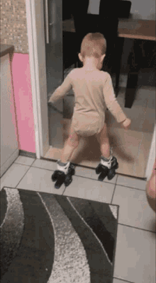

# motivate-me

## Description

A windows command line tool to provide some extra motivation. 

## Usage

Use the following command to execute a `.bat` script for calling a motivational 
`gif`:

```cmd
motivate-me
```


Alternatively, use the `-s` flag if you need to celebrate a success,

```cmd
motivate-me -s
```


or the `-f` flag to come to terms with your failures.

```cmd
motivate-me -f
```



## Installing

1. Clone this repository

```cmd
git clone git@github.com:cl-roberts/motivate-me
```

1. Add `motivate-me` to your path


## Limitations

This only works on windows :cry: